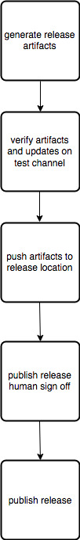

.. _services-shipit:

Service family: ``src/shipit_*``
================================

The Ship It family is a collection of smaller services that help us build, ship, and maintain Releases. There are a few different types of services:

* Frontend - This is where all user interaction with Ship It happens
* Pipeline - The Pipeline service is responsible for managing the end to end process of shipping a Release
* Steps - Step services implement discrete parts of a Pipeline
* Bots - Bots run regularly and are responsible for collecting information required by Ship It

``src/shipit_frontend``
-----------------------

:staging: https://shipit.staging.mozilla-releng.net
:production: https://shipit.mozilla-releng.net

Ship It frontend is a web interface, written in Elm, displaying to Mozilla Release Managers informations about:

- uplift requests for bugs on each Firefox release stage (Aurora, Beta, Release and ESR)
- automated merge tests
- detailed contributors informations

The goal of this project is to be fast, nice looking and always having up-to-date informations from multiple sources (Mozilla bugzilla, mercurial repository, patch analysis, ...)

``src/shipit_uplift``
------------------------

:staging: https://dashboard.shipit.staging.mozilla-releng.net
:production: https://dashboard.shipit.mozilla-releng.net

Ship It Uplift is the backend service storing and serving bug analysis for each Mozilla Firefox release versions: it's used by Ship It frontend.

Architecture:

- Python backend, written with Flask
- Hosted on Heroku (a dyno and Postgresql database)
- Stores analysis as Json in the postgresql database
- Authentication through Taskcluster (no local users)

.. note::

    There is no analysis or long running task in shipit dashboard. It "just" stores data and serves it through a REST api.

``src/shipit_bot_uplift``
-------------------------

Ship It bot uplift is not a service, it's a Python bot, runnning as a Taskcluster hook every 30 minutes.
It does the following tasks on every run:

- Update a cached clone of mozilla-unified repository
- List current bugs on shipit_uplift
- List current bugs for every release versions with an uplift request on Bugzilla
- Run a full bug analysis using libmozdata_ on every new bug (or bugs needing an update)
- Try to merge (through Mercurial graft) every patch in an uplift request
- Report the full analysis to shipit dashboard, so it can be displayed on shipit frontend.

.. _libmozdata: https://github.com/mozilla/libmozdata/

``src/shipit_pipeline``
-----------------------

TODO

``src/shipit_signoff``
----------------------

TODO

``src/shipit_taskcluster``
--------------------------

TODO

Steps
=====

Step Services API
-----------------

In order to ensure the Pipeline service can successfully managed Steps, each Step Service is required to implement the following API:
(TODO, flesh this out more)

* /
** GET - Returns all steps with status (TODO: probably need pagination and filtering here)
* /{uid}
** PUT - Create a new Step
** DELETE - Remove the given Step
* /{uid}/definition
** GET Returns the definition of the given step
* /{uid}/status
** GET Returns the status of the given step.
*** Currently, one of: in_progress, success, failure, cancelled
*** Probably need to add support for including custom service-specific status info.

Step Services are free to add additional endpoints past the required ones.

``shipit v1 and v2 interaction``
--------------------------------

Initially, shipit-v2 will compliment v1 by adding features, as opposed to replacing. The following is a implementation strategy for how that will work.

**ship-it v1 will solely be responsible for submitting and kicking off a new release**

.. code-block:: bash

    % curl -X POST -d "product=firefox&version=99.0" https://ship-it.mozilla.org/submit_release.html

releaserunner_ continues to behave as normal by polling shipit v1 for new releases and, when found, runs release_sanity_, creates taskcluster_graph1_, and notifies release-drivers of new release.
In addition, releaserunner will tell shipit-v2 about the new release and ask shipit-v2 to create a pipeline:

.. code-block:: python

    r = requests.post("https://mozilla-releng.net/shipit_pipeline", data={uid='foo', pipeline={}})

shipit-v2's pipeline will consist of steps representing the release. A step could be sign off step (shipit_signoff), or a taskcluster step (shipit_taskcluster).

shipit-v2 will also create a step for the shipit-v1 generated taskcluster graph (graph1) so that it can add that graph to the shipit-v2 pipeline as a dependency. This means that a taskcluster step can be passed an existing taskcluster graphid to track
rather than always creating a new one.

**How shipit-v1 taskcluster graph1 will differ**

Since graph1 is created by shipit-v1 and includes taskcluster tasks for doing sign offs and publishing releases, it will need to be trimmed and then offload its later tasks to shipit-v2 via subsequent steps within the pipeline.

And so, initially, graph1 will create all required tasks up until the first human sign off. This is easily defined by: 'the first "human decision task" within the graph'.

For example, here is an overview of what a Beta release comprises of in simplified form:

**Betas**

In the beta case, graph1 would finish with 'push artifacts to release location'. There would then be a shipit-v2 pipeline consisting of a sign off step: 'publish release human sign off', and a taskcluster step: 'publish release'

The taskcluster 'publish release' step would comprise of the following tasks: publishing on balrog, bumping next version, updating bouncer, and informing shipit-v1 the release is complete (mark as shipped).

Release candidates would be implemented in a similar manner but since it contains more sign offs, shipit-v1 would offload more tasks to shipit-v2

.. _releaserunner: https://dxr.mozilla.org/build-central/search?q=path%3Apuppet%2Fmanifests%2Fmoco-nodes+releaserunner&redirect=false
.. _release_sanity: https://hg.mozilla.org/build/tools/file/c85a80e0c3e4/buildfarm/release/release-runner.py#l353
.. _taskcluster_graph1: https://hg.mozilla.org/build/tools/file/c85a80e0c3e4/buildfarm/release/release-runner.py#l501

``shipit authentication and authorization``
-------------------------------------------

shipit-v2, at least on initial design, will adopt Taskcluster auth services for both authentication and authorization

This means that rather than re-inventing the wheel or tracking user permissions, shipit-v2 will rely on Taskcluster for its client_, roles_, and scopes model when interacting with any shipit_* api and ui.

As part of a hardened security effort, shipit will then implement MFA either by extending the Taskcluster auth service or adding third party MFA integration.

.. _client: https://tools.taskcluster.net/auth/clients/
.. _roles: https://tools.taskcluster.net/auth/roles/
